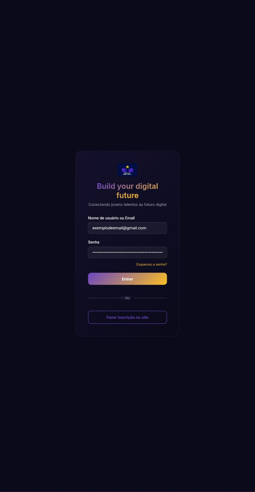
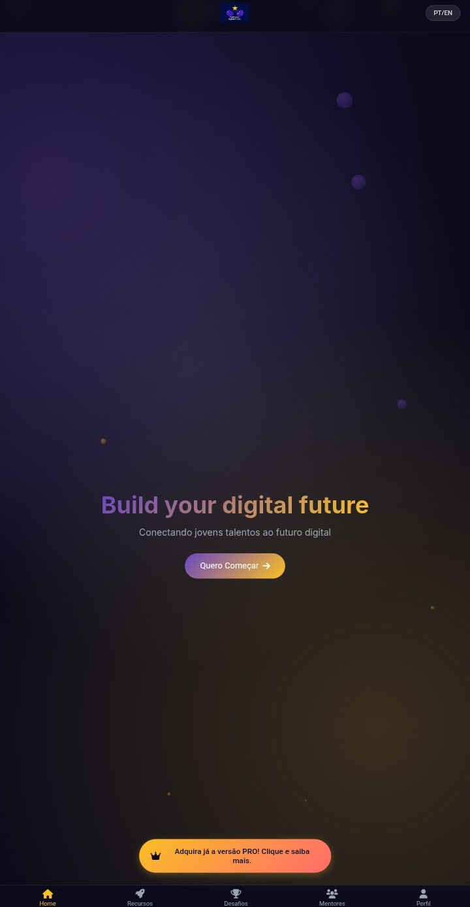
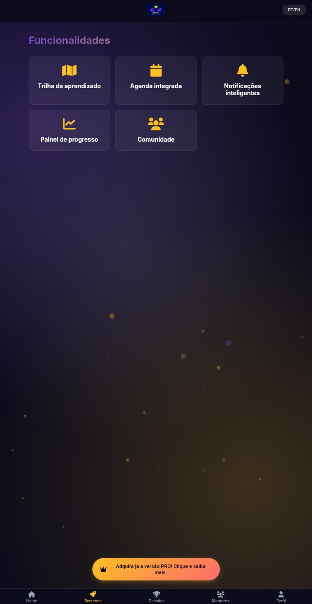
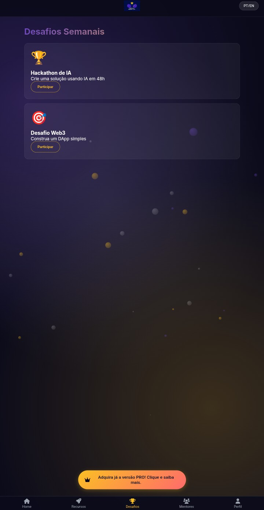
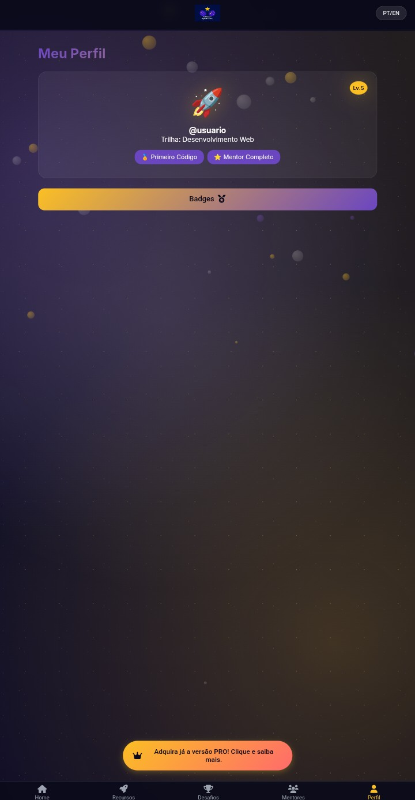
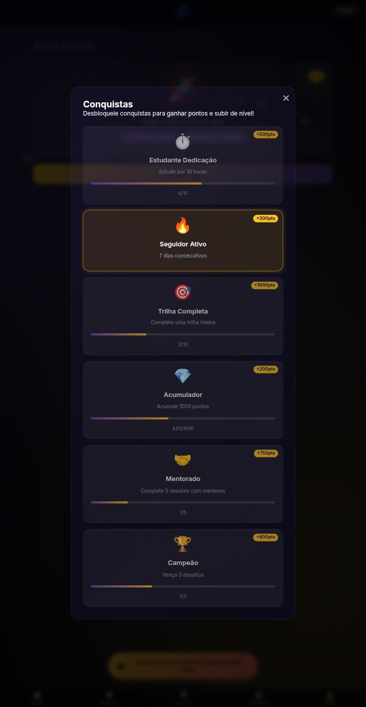
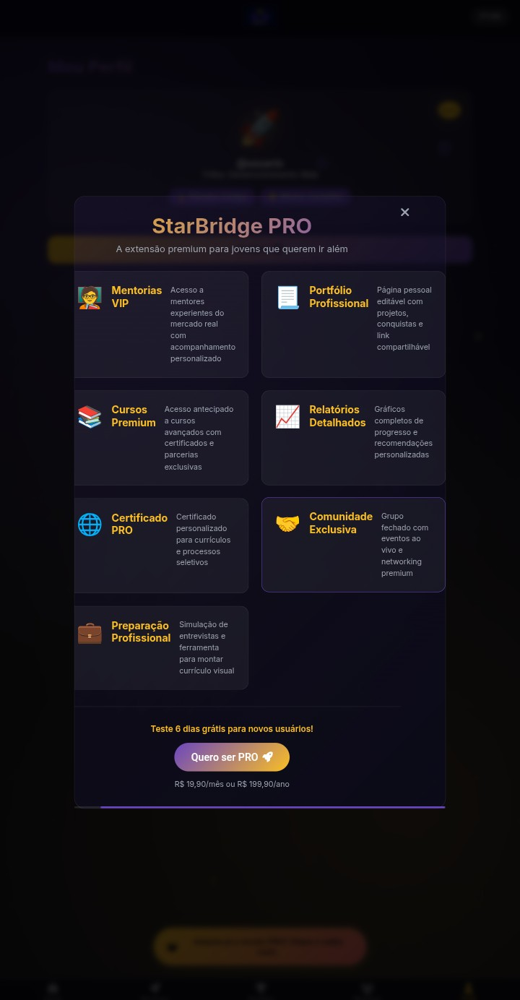

# 🚀 StarBridge - Documentação e Protótipo

Seja bem-vindo ao repositório de conceito do **StarBridge**! 

> **⚠️ NOTA IMPORTANTE:** Este repositório não contém o código-fonte final do projeto. Atualmente, ele serve como um **Showcase de Protótipo** e documentação da visão do produto. O objetivo aqui é validar a ideia e demonstrar a interface e a experiência do usuário (UX/UI).

---

## 💡 O que é o StarBridge?
O StarBridge é uma solução digital inovadora desenhada para conectar alunos da rede pública de ensino a oportunidades reais de carreira e aprendizado técnico. Através de uma plataforma **gamificada**, transformamos a jornada educacional em uma experiênca motivadora e de alto impacto social.

## 📱 Visualização do Protótipo (Spoilers)
Abaixo, você pode conferir as telas principais do aplicativo, focadas em simplicidade e engajamento para o estudante.

### 🖼️ Galeria de Telas

| Área de Login | Tela Inicial | Funcionalidades |
| :---: | :---: | :---: |
|  |  |  |
| *Acesso seguro* | *Ponto de partida* | *Recursos principais* |

| Desafios | Mentores | Perfil do Usuário |
| :---: | :---: | :---: |
|  |  |  |
| *Gamificação ativa* | *Suporte técnico* | *Evolução do aluno* |

| Conquistas | Modo Pro |
| :---: | :---: |
|  |  |
| *Badges e níveis* | *Recursos Premium* |

---

## 🛠️ O Futuro do StarBridge
O desenvolvimento técnico está em fase de planejamento e reestruturação. No futuro, este ou um novo repositório abrigará:

- [ ] Código-fonte do Web App (React/Next.js ou similar).
- [ ] Aplicativo Mobile (Flutter/React Native).
- [ ] Documentação completa da API e Banco de Dados.

Estamos trabalhando nos bastidores para que a ponte entre o estudante e o futuro seja sólida e real!

---
*Projeto idealizado por [Nathan](https://github.com/Nathangame12) e equipe StarBridge.*
